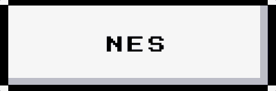

****
###NES Button
****

     

****
###Usage
****
This is the minimal configuration.

```js
import {NESButton} from '@feanor/retro-ui'
```

Use the Component as so :
```jsx
<NESButton />
```
 

****
### Pre-made Available Buttons
****

There are predefined buttons available for different scenarios : 
```jsx
<NESButton btnType="success" btnText-"success"/>
```
 

```jsx
<NESButton btnType="blue"  btnText="Blues" />
```
 
```jsx
<NESButton btnType="error"  btnText="Error!" />
```
 
```jsx
<NESButton btnType="warning" btnText="Danger" />
```
 

****
 ### Special Buttons : Active and Disabled
****
 + #### Active Button :
 A button can be set as active using this :
```jsx
<NESButton btnText="feanor08" isBtnActive=true />
```
 
+  #### Disabled Button :
 ```jsx
 <NESButton btnType="disabled"  btnText="disabled" />
 ```
 
****
 ### Customization
****
####Available Props :

+ **btnType**   : 
   *default*    : "normal"
   *values*     : "normal" "blue" "success" "warning" "success" "error" "disabled" "custom"

+ **btnText**   :
   *default*    : "feanor08"
   *note*       : Expects a string value here.  

+ **btnSize**   :
   *default*    : "300"
   *note*       : Expects a numeric value. The value is used as so :
                    width   : btnSize
                    height  : btnSize / 3
   
+ **btnText**   :
   *default*    : "feanor08"

+ **isBtnActive**   : 
   *default*    : false
   *values*     : false true
   *note*       : Use this prop to change appearance when the button is selected. 

+ **customBackColor**   :
    *default*   : 'black'
    *note* :    : Expects a string. Needs *btnType* to be *"custom"*

+ **customShadowColor**   :
    *default*   : 'rgb(173, 175, 188)'
    *note* :    : Expects a string. Needs *btnType* to be *"custom"*

+ **customTopColor**   :
    *default*   : 'white'
    *note* :    : Expects a string. Needs *btnType* to be *"custom"*

+ **customTopSelectedColor**   :
    *default*   : 'rgb(231, 231, 231)'
    *note* :    : Expects a string. Needs *btnType* to be *"custom"*

+ **customTextColor**   :
    *default*   : 'black'
    *note* :    : Expects a string. Needs *btnType* to be *"custom"*

 

