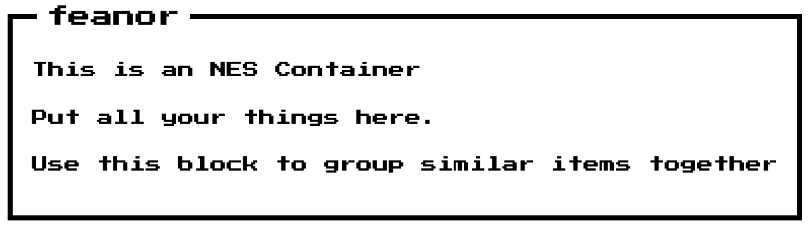

****
 ### NES Container
****



****
 ### Usage
****
This is the minimal configuration.

```js
import {NESContainer} from '@feanor/retro-ui'
```

Use the Component as so :
```jsx
<NESContainer />
```

****
 ### Customization
****
####Available Props :

+ **containerTitle**   :
   *default*    : "Title Here"
   *note*       : Expects a string value here.  

+ **titlePosition**   :
   *default*    : "3%"
   *note*       : Expects a pixel or percentage value. This defines the position of the title from the left. 
 