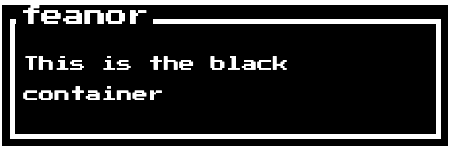

****
 ### NES Container
****


****
 ### Usage
****
This is the minimal configuration.

```js
import {NESContainer} from '@feanor/retro-ui'
```

Use the Component as so :
```jsx
<NESContainer containerTitle="feanor"  containerType="black">
   <p>This is the black container</p>
</NESContainer>
```
 

****
 ### Customization
****
####Available Props :

+ **containerTitle**   :
   *default*    : "Title Here"
   *note*       : Expects a string value here.  
+ **titlePosition**   :
   *default*    : "3%"
   *note*       : Expects a pixel or percentage value. This defines the position of the title from the left. 
+ **containerType**  :
   *default*    : "white"
   *values*     : "white" "black"

****
 ### Issues
****
Due to having rendering differences in Chrome/Safari and Firefox, The height of the Title has been set to 30px. 
